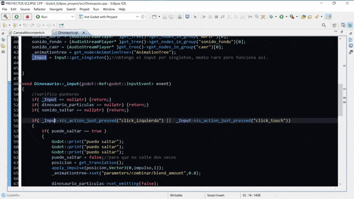

# Configuracion de eclipse con colores de Gdscript y preferencias para programar y depurar con Godot Engine, GDnative y C++

## para usar ir a - file / import / general /  preference - luego seleccionar la ubicacion y importar todo

